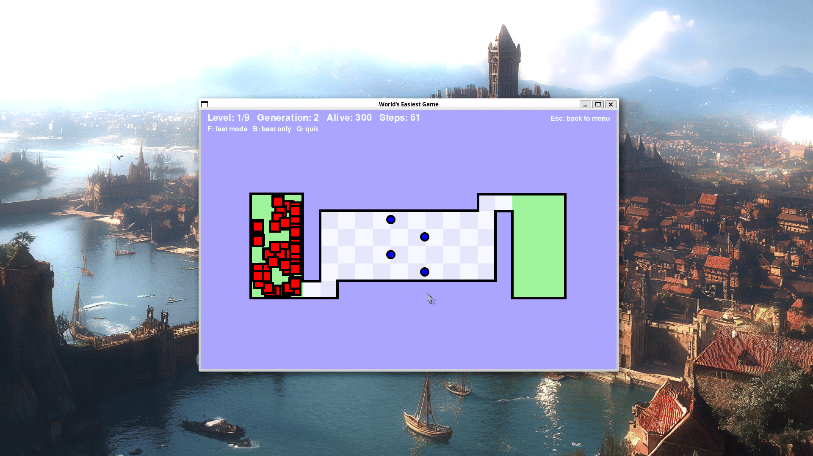
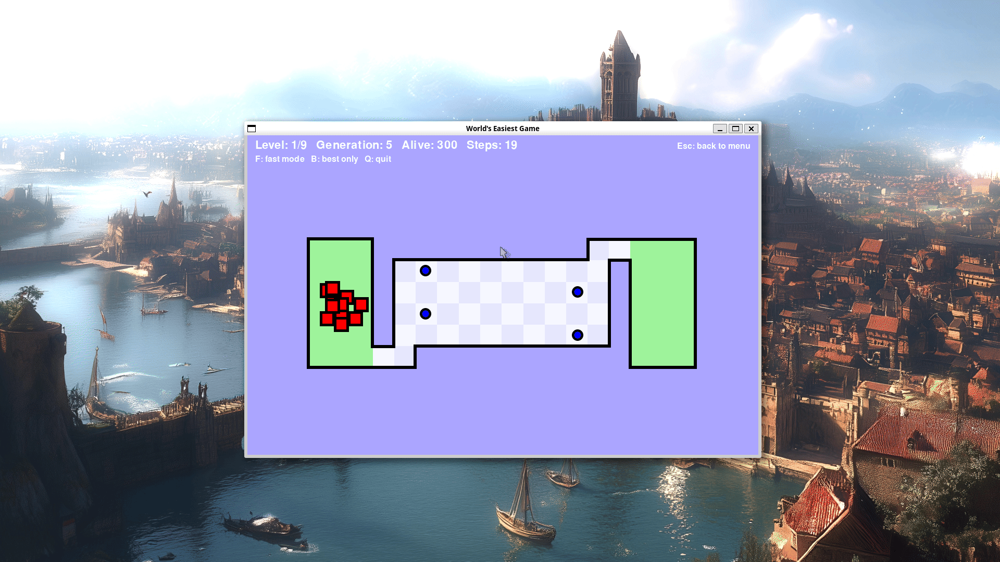

Recreating the popular flash game "World's hardest game", but making it easy by having AI beat it

### Running it

```
uv run worlds-easiest-game
```

### 300 players



### Fast mode (Toggelable by F)



The game opens on a menu with two options

1. Click `Start game` to play the game yourself (Move with WASD)
2. `Watch the AI beat the game` to watch the learner train on every level (see [Watching it learn](#watching-it-learn))

Press `Esc` in any level to go back to the menu  
Press `Q` or close the window to quit

## Dependencies 
(pygame, and the game itself) come from `uv`, which installs them into the project environment on first run

### Developer mode

Run `uv run worlds-easiest-game --dev` to enable god mode. Press `T` during a level to
toggle it

### Teaching an AI to beat the game

```
uv run worlds-easiest-game train 300
```

trains a population of 300 characters to beat every level in turn, with no
window, as fast as the machine allows. A character plays by movement alone, from
its own list of moves (one of the eight directions or standing still, each held
for 12 steps, a tenth of a second), until it dies, beats the level, or its moves
run out. Each level gives a character a time limit of its own, at least twice
as long as a perfect run of it takes: 15 seconds on level 1, and up to 50
seconds on level 6.

After each generation, every character is scored by where its run ended: how far
it still had to walk along the corridors, never through a wall, to its next
target. On a level with coins the goal only counts once every coin is collected,
so the targets are the coins it has not collected yet, whichever is the shortest
walk away, and then the goal. On level 9 the checkpoint is a target too, until
the character reaches it. Every coin collected, and the checkpoint reached, is a
large step up in score: a character that has reached one more target always
scores above one that has not, wherever and however each ended. Beating the
level scores highest, and higher the sooner it happens. A character that died
counts as having ended 3 tiles further from its target than where it died, so
one that waits where it is safe for a gap to come round scores above one that
rushed in and died just ahead of it, while dying well ahead of the rest still
counts as getting further.

The best character carries over to the next generation unchanged, so the best
score never drops. The rest are children of the best-ranked fifth of the
generation, each picking its parent from them at random. Characters rank by
their scores, but of those whose runs ended in the same 20-pixel square, with as
many coins collected (whichever coins they are) and the checkpoint reached or
not, only the best counts; the others rank after the best of every square. So
the parents are spread over every place the runs got to, and the population does
not crowd onto one dead end. A child plays its parent's moves up to a random
point at most 5 moves before where its parent's run ended, then new random
moves, up to 3 past that end: it usually tries something else shortly before
where its parent died, or carries on from where its parent ran out of moves. It
can replay its parent's ending instead, though, when it goes back no moves, or
when its new moves repeat its parent's, as they often do along a straight dash.
Each new random move repeats the one before it 60% of the time and is otherwise
any of the nine, so straight dashes and long waits come up often. The first
generation's lists are 10 random moves long, and no list grows past the level's
time limit.

Learning goes level by level. Once a character beats a level, its winning moves
are kept as that level's solution, and a new population starts on the next
level, from its spawn. Once the last level is beaten, the kept solutions together
are one run of the whole game, and the command replays it end to end, level by
level, printing when each level was beaten again and how long the whole game
took.

Each level starts with a line naming it, and each generation prints one line:
its number, the best score, how far the best character ended from its next
target (and on a level with coins, how many it collected), how many characters
died, and whether one beat the level. Beating a level prints the generation
that did it, how long training on the level took, and the length of the winning
list. Training stops once every level is beaten, or when a level has had
`--generations` generations (1000 unless given) without being beaten, naming
that level and exiting with status 1. The same `--seed` always trains the same
way; without one a random seed is used, and printed. `train --help` lists the
other settings, each named after what it sets above: `--hold`, `--first-moves`,
`--growth`, `--backtrack`, `--persistence`, `--parents`, `--spot`,
`--death-cost`, and `--time-limit` (which, if given, every level gets instead
of its own).

With 300 characters, the defaults beat the whole game. On an Apple M3, seeds 1,
2 and 3 each beat every level in turn in 354 to 373 generations and 4 min 46 s
to 5 min 38 s of training, and each replay played the game from level 1 to the
win in 90 to 93 seconds of play. Level 6, the longest, takes most of that: 109
to 128 generations and 2 min 27 s to 3 min 29 s. Every other level took at most
61 generations and under a minute.
`uv run python game/main.py train 300` does the same.

